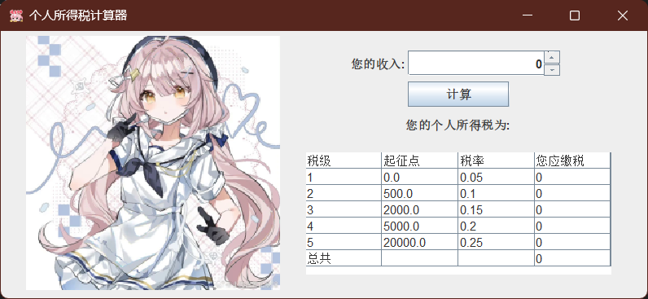

# PersonalTax

这是一个编译原理实验作业，通过这次作业学习 Java 开发项目规范。

## 使用

### GUI 程序

在 Release 中找到自己平台的可执行文件，下载使用。或者下载 jar 文件用 java 运行。

### 使用 API

API 文档：https://taf.fyi/PersonalTax

## 实验评价标准

**课程**: DCS292 编译器构造实验  
**项目**: 计算个人所得税 PersonalTax  
**班级**: 中山大学计算机学院各专业三年级本科生  
**学生**: fuuzen  

<table>
  <thead>
    <tr>
      <th>序号</th>
      <th>评分大类</th>
      <th>评分项目</th>
      <th>权重</th>
      <th>单项评分</th>
      <th>实验成绩</th>
      <th>备注说明</th>
    </tr>
  </thead>
  <tbody>
    <tr>
      <td>0</td>
      <td>总分</td>
      <td>总分</td>
      <td>100%</td>
      <td>100</td>
      <td></td>
      <td></td>
    </tr>
    <tr>
      <td>1</td>
      <td rowspan="1">基本功能需求</td>
      <td>可运行的程序</td>
      <td>30%</td>
      <td>100</td>
      <td>30</td>
      <td></td>
    </tr>
    <tr>
      <td>2</td>
      <td rowspan="3">编程风格</td>
      <td>标识符命名</td>
      <td>6%</td>
      <td>100</td>
      <td>6</td>
      <td></td>
    </tr>
    <tr>
      <td>3</td>
      <td>文档化注释</td>
      <td>6%</td>
      <td>100</td>
      <td>6</td>
      <td></td>
    </tr>
    <tr>
      <td>4</td>
      <td>程序版面</td>
      <td>3%</td>
      <td>100</td>
      <td>3</td>
      <td></td>
    </tr>
    <tr>
      <td>5</td>
      <td rowspan="3">结构化程序设计</td>
      <td>子程序功能划分</td>
      <td>10%</td>
      <td>100</td>
      <td>10</td>
      <td></td>
    </tr>
    <tr>
      <td>6</td>
      <td>子程序接口设计</td>
      <td>5%</td>
      <td>100</td>
      <td>5</td>
      <td></td>
    </tr>
    <tr>
      <td>7</td>
      <td>控制结构运用</td>
      <td>5%</td>
      <td>100</td>
      <td>5</td>
      <td></td>
    </tr>
    <tr>
      <td>8</td>
      <td rowspan="4">面向对象程序设计</td>
      <td>类的提炼与建模</td>
      <td>5%</td>
      <td>100</td>
      <td>5</td>
      <td></td>
    </tr>
    <tr>
      <td>9</td>
      <td>类的属性与行为设计</td>
      <td>5%</td>
      <td>100</td>
      <td>5</td>
      <td></td>
    </tr>
    <tr>
      <td>10</td>
      <td>访问控制设计</td>
      <td>5%</td>
      <td>100</td>
      <td>5</td>
      <td></td>
    </tr>
    <tr>
      <td>11</td>
      <td>异常处理</td>
      <td>5%</td>
      <td>100</td>
      <td>5</td>
      <td></td>
    </tr>
    <tr>
      <td>12</td>
      <td rowspan="3">实验报告</td>
      <td>实验报告内容</td>
      <td>4%</td>
      <td>100</td>
      <td>4</td>
      <td></td>
    </tr>
    <tr>
      <td>14</td>
      <td>UML表示</td>
      <td>3%</td>
      <td>100</td>
      <td>3</td>
      <td></td>
    </tr>
    <tr>
      <td>15</td>
      <td>文档与源程序组织</td>
      <td>3%</td>
      <td>100</td>
      <td>3</td>
      <td></td>
    </tr>
    <tr>
      <td>16</td>
      <td>其他</td>
      <td>测试用例及测试结果</td>
      <td>5%</td>
      <td>100</td>
      <td>5</td>
      <td></td>
    </tr>
  </tbody>
</table>

**详细描述**（“+”开头表示做得好的地方，“-”开头表示做得不足的地方，“?”开头表示该做法有待商榷）  
**批阅老师**: 李文军
